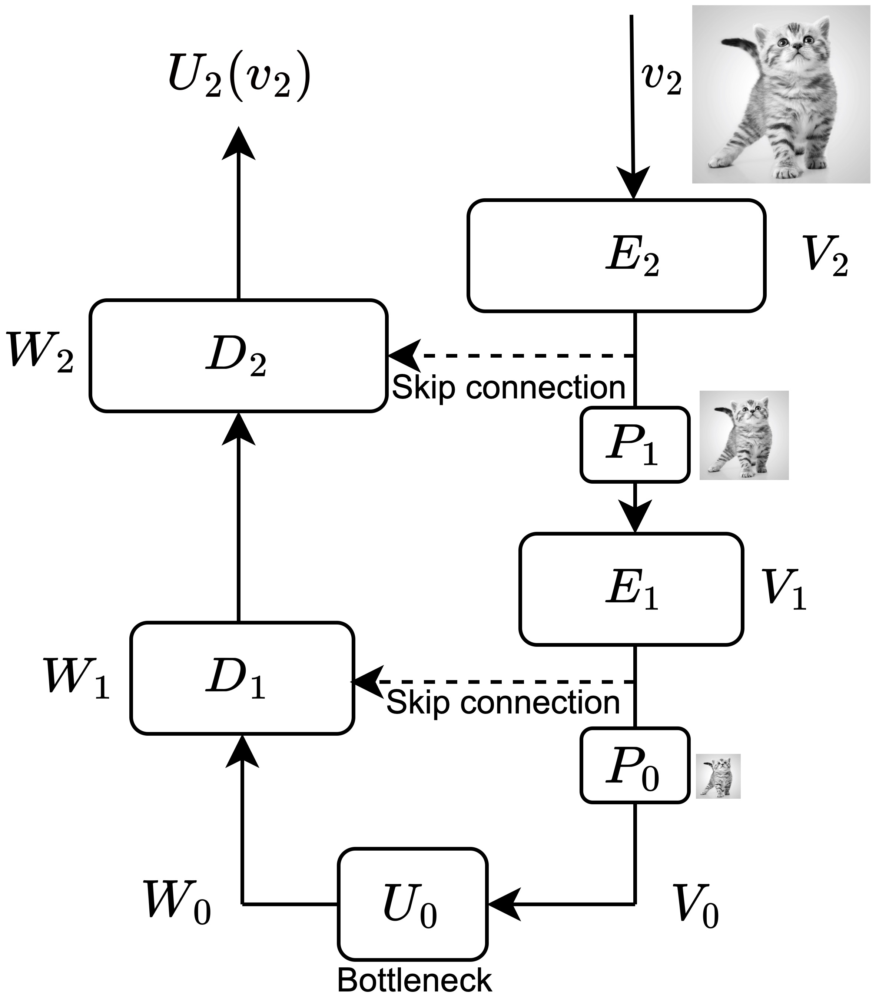

# A Unified Framework for U-Net Design and Analysis

  **[Overview](#Overview)**
| **[Setup](#Setup)**
| **[Reproducing key results](#Reproducing)**
| **[Contributing](#contributing)**
| **[Citation](#citation)**

[](https://arxiv.org/abs/2305.19638.pdf)
[](https://www.python.org/downloads/release/python-370/)
[](https://pytorch.org/)
[](https://opensource.org/licenses/MIT)
[](https://GitHub.com/Naereen/StrapDown.js/graphs/commit-activity)



This repository is the official implementation of [A Unified Framework for U-Net Design and Analysis](https://arxiv.org/abs/2305.19638). 

## Overview

This repository contains four self-contained *sub-repositories* (in the folders `diff_mnist`, `diff_cifar`, `pdearena` and `wmh`). Their corresponding original code bases are:

* `diff_mnist`: Generative modelling with diffusion models on MNIST. Original code base: [https://github.com/JTT94/torch_ddpm](https://github.com/JTT94/torch_ddpm)
* `diff_cifar`: Generative modelling with diffusion models on CIFAR10. Original code base: [https://github.com/w86763777/pytorch-ddpm](https://github.com/w86763777/pytorch-ddpm)
* `pdearena`: PDE modelling on Navier-Stokes and Shallow water. Original code base: [https://github.com/microsoft/pdearena](https://github.com/microsoft/pdearena)
* `wmh`: Image segmentation on White Matter Hyperintensity (WMH) Segmentation Challenge. Original code base: [https://github.com/hongweilibran/wmh_ibbmTum](https://github.com/hongweilibran/wmh_ibbmTum)

We refer to Appendix E in the paper for more details on the existing code and other assets we used and built on.

## Setup 

### Installation

Accompanying each sub-repository, we provide a pip requirements file named `requirements_<sub-repostiory-name>.txt`. #
It contains the dependencies that we used in our working setup for each repository.
We recommend setting up a separate virtual environment for each of the four code bases.

Once you set up the virtual environment, to install the requirements, run: 

```setup
pip install -r requirements_<sub-repository-name>.txt
```

For example, to set up the diffusion models on MNIST code base, run

```setup
pip install -r requirements_diff_mnist.txt
```

after setting up your virtual environment. 
We refer to the original code bases for further instructions on installation.

### Download datasets

<details><summary>MNIST</summary>
This dataset will be downloaded automatically upon running the training script the first time.
</details>

<details><summary>CIFAR</summary>
Download the [CIFAR-10 python version](https://www.cs.toronto.edu/~kriz/cifar-10-python.tar.gz) from https://www.cs.toronto.edu/~kriz/cifar.html. 
Unzip to receive the folder `cifar-10-batches-py`, and move it to `diff_cifar/data`.
</details>

<details><summary>Navier Stokes dataset (PDEArena)</summary>
The data is [available on HuggingFace](https://huggingface.co/pdearena). 
You require the Navier Stokes - 2D Standard dataset.
To download it with SSH: 

```
# Make sure you have git-lfs installed (https://git-lfs.com)
git lfs install
git clone git@hf.co:datasets/pdearena/NavierStokes-2D

# if you want to clone without large files – just their pointers
# prepend your git clone with the following env var:
GIT_LFS_SKIP_SMUDGE=1
```

Once downloaded, you need to refer to the path you downloaded the dataset to when running the training command (See below), using the `--data.data_dir=<data-dir>` flag.
For instance, if your dataset has been downloaded to `data/NavierStokes2D_smoke`, use the command line argument `--data.data_dir=data/NavierStokes2D_smoke`.
We refer to https://microsoft.github.io/pdearena/datadownload/ for further details and the command for using HTTPS to download the data as an alternative.
</details>

<details><summary>Shallow water dataset (PDEArena)</summary>
The data is [available on HuggingFace](https://huggingface.co/pdearena). 
You require the Shallow water - 2D dataset.
To download it with SSH: 

```
# Make sure you have git-lfs installed (https://git-lfs.com)
git lfs install
git clone git@hf.co:datasets/pdearena/ShallowWater-2D

# if you want to clone without large files – just their pointers
# prepend your git clone with the following env var:
GIT_LFS_SKIP_SMUDGE=1
```

Once downloaded, you need to refer to the path you downloaded the dataset to when running the training command (See below), using the `--data.data_dir=<data-dir>` flag.
For instance, if your dataset has been downloaded to `data/ShallowWater2D`, use the command line argument `--data.data_dir=data/ShallowWater2D`.
We refer to https://microsoft.github.io/pdearena/datadownload/ for further details and the command for using HTTPS to download the data as an alternative.
</details>

<details><summary>WMH dataset</summary>
Go to [https://dataverse.nl/dataset.xhtml?persistentId=doi:10.34894/AECRSD](https://dataverse.nl/dataset.xhtml?persistentId=doi:10.34894/AECRSD) -> Access Dataset -> Download ZIP.
Accept the dataset terms when prompted, the download should start shortly thereafter.
Unzip the downloaded folder, and place its contents in `wmh/data`.
Now, run the preprocessing script `preprocessing.py`, which will save a preprocessed dataset in `data_preprocessed/`.
</details>


## Logging

To log our experiments, we use weights&biases (wandb).
To use the same logger, you are required to provide your wandb credentials as detailed below: 

<details><summary>diff_mnist</summary>
Provide your user ID, team name and project name in `setup/wandb.yml`.
</details>

<details><summary>diff_cifar</summary>
Provide your user ID, team name and project name in `wandb.yml`.
</details>

<details><summary>pdearena</summary>
In `config.yml`, provide your project name under the key `trainer.logger.init_args.project`, and your team name under the key `trainer.logger.init_args.entity`.
</details>

<details><summary>wmh</summary>
Provide your user ID, team name and project name in `wandb.yml`.
</details>


## Reproducing key results

In the following, we provide instructions to reproduce key experimental results in our main paper.
We refer to the `hyperparams.py` files in the respective repostories for an overview on the hyperparams that can be set, 
and also the instructions in the original code bases on how to run the code.
To reproduce Table 1 and the FNO vs. U-Net comparison, one requires to run each of the below runs three times with different random seeds, using either the command argument `--seed` or `--seed_everything`, respectively.

### The role of the encoder in a U-Net (Section 5.1, Table 1)

<details><summary>Navier-Stokes</summary>

Using repo `pdearena`.

* Residual U-Net: 

`CUDA_VISIBLE_DEVICES=0 python scripts/train.py -c configs/navierstokes2d.yaml --data.data_dir=<data-dir> --trainer.devices=1 --trainer.max_epochs=50 --data.batch_size=8 --data.time_gap=0 --data.time_history=4 --data.time_future=1 --model.name=Unetbase-64_G --model.lr=2e-4 --optimizer=AdamW --optimizer.lr=2e-4 --optimizer.weight_decay=1e-5 --lr_scheduler=LinearWarmupCosineAnnealingLR --lr_scheduler.warmup_epochs=5 --lr_scheduler.max_epochs=50 --lr_scheduler.eta_min=1e-7 --trainer.plugins DisabledSLURMEnvironment --trainer.accelerator gpu --model.dwt_encoder False --model.multi_res_loss False --model.freeze_lower_res False --model.up_fct interpolate_nearest --model.n_extra_resnet_layers 0 --seed_everything 1`

* Multi-ResNet, no params. added in dec.

`CUDA_VISIBLE_DEVICES=0 python scripts/train.py -c configs/navierstokes2d.yaml --data.data_dir=<data-dir> --trainer.devices=1 --trainer.max_epochs=50 --data.batch_size=8 --data.time_gap=0 --data.time_history=4 --data.time_future=1 --model.name=Unetbase-64_G --model.lr=2e-4 --optimizer=AdamW --optimizer.lr=2e-4 --optimizer.weight_decay=1e-5 --lr_scheduler=LinearWarmupCosineAnnealingLR --lr_scheduler.warmup_epochs=5 --lr_scheduler.max_epochs=50 --lr_scheduler.eta_min=1e-7 --trainer.plugins DisabledSLURMEnvironment --trainer.accelerator gpu --model.dwt_encoder True --model.multi_res_loss False --model.freeze_lower_res False --model.up_fct interpolate_nearest --model.n_extra_resnet_layers 0 --seed_everything 1`

* Multi-ResNet, saved params. added in dec.

`CUDA_VISIBLE_DEVICES=0 python scripts/train.py -c configs/navierstokes2d.yaml --data.data_dir=<data-dir> --trainer.devices=1 --trainer.max_epochs=50 --data.batch_size=8 --data.time_gap=0 --data.time_history=4 --data.time_future=1 --model.name=Unetbase-64_G --model.lr=2e-4 --optimizer=AdamW --optimizer.lr=2e-4 --optimizer.weight_decay=1e-5 --lr_scheduler=LinearWarmupCosineAnnealingLR --lr_scheduler.warmup_epochs=5 --lr_scheduler.max_epochs=50 --lr_scheduler.eta_min=1e-7 --trainer.plugins DisabledSLURMEnvironment --trainer.accelerator gpu --model.dwt_encoder True --model.multi_res_loss False --model.freeze_lower_res False --model.up_fct interpolate_nearest --model.n_extra_resnet_layers 3 --seed_everything 1`

</details>

<details><summary>Shallow water</summary>

Using repo `pdearena`.

* Residual U-Net: 

`CUDA_VISIBLE_DEVICES=0 python scripts/train.py -c configs/shallowwater2d_2day.yaml --data.data_dir=<data-dir> --trainer.devices=1 --model.name=Unetbase-64_G --model.lr=2e-4 --optimizer=AdamW --optimizer.lr=2e-4 --optimizer.weight_decay=1e-5 --trainer.plugins DisabledSLURMEnvironment --trainer.accelerator gpu --model.dwt_encoder False --model.multi_res_loss False --model.freeze_lower_res False --model.up_fct interpolate_nearest --model.n_extra_resnet_layers 0 --seed_everything 1`

* Multi-ResNet, no params. added in dec.

`CUDA_VISIBLE_DEVICES=0 python scripts/train.py -c configs/shallowwater2d_2day.yaml --data.data_dir=<data-dir> --trainer.devices=1 --model.name=Unetbase-64_G --model.lr=2e-4 --optimizer=AdamW --optimizer.lr=2e-4 --optimizer.weight_decay=1e-5 --trainer.plugins DisabledSLURMEnvironment --trainer.accelerator gpu --model.dwt_encoder True --model.multi_res_loss False --model.freeze_lower_res False --model.up_fct interpolate_nearest --model.n_extra_resnet_layers 0 --seed_everything 1`

* Multi-ResNet, saved params. added in dec.

`CUDA_VISIBLE_DEVICES=0 python scripts/train.py -c configs/shallowwater2d_2day.yaml --data.data_dir=<data-dir> --trainer.devices=1 --model.name=Unetbase-64_G --model.lr=2e-4 --optimizer=AdamW --optimizer.lr=2e-4 --optimizer.weight_decay=1e-5 --trainer.plugins DisabledSLURMEnvironment --trainer.accelerator gpu --model.dwt_encoder True --model.multi_res_loss False --model.freeze_lower_res False --model.up_fct interpolate_nearest --model.n_extra_resnet_layers 3 --seed_everything 1`

</details>

<details><summary>WMH</summary>

Using repo `wmh`.

* Residual U-Net: 

`CUDA_VISIBLE_DEVICES=0 python train_pt.py --device cuda --batch_size 32 --train_loss_every_iters 50 --train_hist_every_iters 500 --train_prec_recall_curve_every_iters 500 --hidden_channels 16 --data_augmentation none --early_stop_patience 3 --early_stop_min_improvement 0.02 --val_every_epochs 3 --num_epochs_list 25 --dwt_encoder False --n_extra_resnet_layers 0 --seed 1`

* Multi-ResNet, no params. added in dec.

`CUDA_VISIBLE_DEVICES=0 python train_pt.py --device cuda --batch_size 32 --train_loss_every_iters 50 --train_hist_every_iters 500 --train_prec_recall_curve_every_iters 500 --hidden_channels 16 --data_augmentation none --early_stop_patience 3 --early_stop_min_improvement 0.02 --val_every_epochs 3 --num_epochs_list 25 --dwt_encoder True --n_extra_resnet_layers 0 --seed 1`

* Multi-ResNet, saved params. added in dec.

`CUDA_VISIBLE_DEVICES=0 python train_pt.py --device cuda --batch_size 32 --train_loss_every_iters 50 --train_hist_every_iters 500 --train_prec_recall_curve_every_iters 500 --hidden_channels 16 --data_augmentation none --early_stop_patience 3 --early_stop_min_improvement 0.02 --val_every_epochs 3 --num_epochs_list 25 --dwt_encoder True --n_extra_resnet_layers 3 --seed 1`

</details>

### Staged training enables multi-resolution training and inference (Section 5.2)

<details><summary>CIFAR</summary>

Using repo `diff_cifar`.

`CUDA_VISIBLE_DEVICES=0 python main.py --device cuda --sample_step 10000 --save_step 100000 --eval_step 200000 --NUM_ITERATIONS_LIST 50000 50000 50000 1500003 --DWT_ENCODER False --FREEZE_LOWER_RES False --MULTI_RES_LOSS False`

</details>

### U-Nets encoding topological structure (Section 5.3)

<details><summary>MNIST-Triangular</summary>

Using repo `diff_mnist`.

`CUDA_VISIBLE_DEVICES=0 python main.py --DEVICE cuda --BETA_MIN 0.1 --BETA_MAX 20 --N 30 --EPS 1e-3 --T 1.0 --NUM_ITERATIONS_LIST 10000 --DWT_ENCODER False --MULTI_RES_LOSS False --AVG_POOL_DOWN True --DATASET mnist_triangular --RESOLUTION 64 --to_square_preprocess True`

</details>

### FNO vs. U-Net comparison (Table in rebuttal PDF)

<details><summary>FNO, Navier-Stokes</summary>

`CUDA_VISIBLE_DEVICES=0 python scripts/train.py -c configs/navierstokes2d.yaml --data.data_dir=<data-dir> --trainer.max_epochs=30 --trainer.devices=1 --data.batch_size=8 --data.time_gap=0 --data.time_history=4 --data.time_future=1 --model.name=FNO-128-8m --model.lr=2e-4 --optimizer=AdamW --optimizer.lr=2e-4 --optimizer.weight_decay=1e-5 --lr_scheduler=LinearWarmupCosineAnnealingLR --lr_scheduler.warmup_epochs=5 --lr_scheduler.max_epochs=30 --lr_scheduler.eta_min=1e-7 --trainer.plugins DisabledSLURMEnvironment --trainer.accelerator gpu --seed_everything 1`

</details>

<details><summary>FNO, Shallow water</summary>

`CUDA_VISIBLE_DEVICES=0 python scripts/train.py -c configs/shallowwater2d_2day.yaml --data.data_dir=<data-dir> --trainer.devices=1 --model.name=FNO-128-8m --model.lr=2e-4 --optimizer=AdamW --optimizer.lr=2e-4 --optimizer.weight_decay=1e-5 --trainer.plugins DisabledSLURMEnvironment --trainer.accelerator gpu --seed_everything 1 --trainer.max_epochs=15 --lr_scheduler.max_epochs=15`

</details>

U-Net results in this table: see 'The role of the encoder in a U-Net (Section 5.1, Table 1)', Navier-Stokes and Shallow water.

## Contributing

We welcome extensions of this repository!
To ask a question, or report a bug, please leave an issue.

Any code which is not part of the original code bases is provided under MIT License. 
For all other code, we refer to the respective licenses in the original code bases (all also MIT licensed), which are part of the sub-repositories in this code base.


## Citation

If you find this code repository or the accompanying paper useful, please cite [our work](https://arxiv.org/abs/2305.19638.pdf) as:

```
@article{williamsfalck2023unified,
  title={A Unified Framework for U-Net Design and Analysis},
  author={Williams, Christopher and Falck, Fabian and Deligiannidis, George and Holmes, Chris and Doucet, Arnaud and Syed, Saifuddin},
  journal={arXiv preprint arXiv:2305.19638},
  year={2023}
}
```
